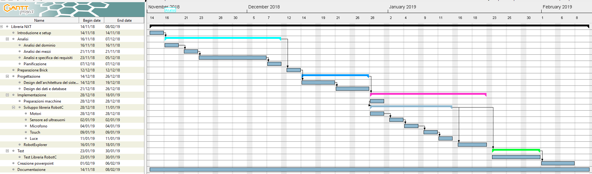

- [Introduzione](#introduzione)
  * [Informazioni sul progetto](#informazioni-sul-progetto)
  * [Abstract](#abstract)
  * [Scopo](#scopo)
- [Analisi](#analisi)
  * [Analisi del dominio](#analisi-del-dominio)
  * [Analisi e specifica dei requisiti](#analisi-e-specifica-dei-requisiti)
  * [Pianificazione](#pianificazione)
  * [Analisi dei mezzi](#analisi-dei-mezzi)
- [Progettazione](#progettazione)
  * [Design dei dati e database](#design-dei-dati-e-database)
- [Implementazione](#implementazione)
  * [SimpleWaitLib](#simplewaitlib)
    + [Wait](#wait)
    + [WaitNxtButtons](#waitnxtbuttons)
    + [WaitDistance](#waitdistance)
    + [WaitMicrophone](#waitmicrophone)
    + [WaitLight](#waitlight)
    + [WaitTouch](#waittouch)
  * [SimpleMotorLib](#simplemotorlib)
    + [goMotorStandard](#gomotorstandard)
    + [goMotorSeconds](#gomotorseconds)
    + [goMotorDegrees](#gomotordegrees)
    + [goMotorRotations](#gomotorrotations)
    + [stopMotor](#stopmotor)
  * [Explorer](#explorer)
      - [Il diagramma di flusso del programma](#il-diagramma-di-flusso-del-programma)
- [Test](#test)
  * [Protocollo di test](#protocollo-di-test)
  * [Risultati test](#risultati-test)
  * [Mancanze/limitazioni conosciute](#mancanze-limitazioni-conosciute)
- [Consuntivo](#consuntivo)
- [Conclusioni](#conclusioni)
  * [Sviluppi futuri](#sviluppi-futuri)
  * [Considerazioni personali](#considerazioni-personali)
  * [Sitografia](#sitografia)
- [Allegati](#allegati)

<div style="page-break-after: always;"></div>

## Introduzione

### Informazioni sul progetto

  Il progetto è gestito e realizzato dall’allievo Luca Di Bello e Fadil Smajlbasic (studenti di informatica all’Arti e Mestieri di Trevano) sotto la supervisione del professor Luca Muggiasca, Adriano Barchi, Francesco Mussi e Massimo Sartori.
  La realizzazione del progetto inizia il 16 novembre 2018 (16/11/18) e dovrà essere consegnato entro il 08.02.19

### Abstract

  In this document we will describe how we made a library for the Lego Mindstorms NXT. The library needs to be simple to use. Before our solution the users needed to use the IDE provided by Lego, and use the graphical interface which makes even a simple line follower a frustrating operation of needing to use the drag and drop function of the “Lego programming blocks”. We were tasked to make the process simpler creating a library with some useful functions for the various input-output interfaces (buttons, ultrasonic sensors, motors, ecc.) that the NXT has to offer, furthermore it uses the standard coding format that a lot of programming languages use since the language that we are using derives from C. We are using the RobotC language to write the library. With the help of this library an average student should be able to do basic programs for the Lego NXT without any problems.

### Scopo
  Lo scopo del progetto è di creare una libreria da utilizzare per la programmazione del blocchetto NXT. Lo scopo di questa libreria è rendere la programmazione del robot lego più semplice ed efficace aggiungendo delle funzionalità tipiche per ogni sensore del robot. Questo permette di salvare molto tempo nel processo di implementazione del codice.

## Analisi

### Analisi del dominio

  In questo momento il blocchetto NXT viene programmato tramite il programma grafico chiamato “Lego Mindstorms”, esso non necessita alcuna conoscenza di linguaggi di programmazione per essere utilizzato, questo perché utilizza una programmazione grafica e non testuale.
  Essendo molto semplice la programmazione grafica si perdono diverse funzionalità che si possono riottenere cambiando approccio, e quindi passando alla programmazione nuda e cruda. Essa può essere svolta con il linguaggio *RobotC*.
  Gli alunni che utilizzano i robot Lego non hanno mai programmato i blocchetti in un linguaggio differente da quello grafico, ma dispongono delle limitate conoscenze del linguaggio Java.

### Analisi e specifica dei requisiti

  Il committente necessita di una libreria scritta nel linguaggio *RobotC* il quale scopo è quello di semplificare il processo di programmazione dei robot NXT della Lego. Esse devono comprendere dei metodi user-friendly (quindi che vengono richiamati e funzionano senza nessun bisogno di una programmazione aggiuntiva da parte dell'utilizzatore). Oltre alle librerie il committente necessita anche di una guida cartacea che spiega il processo di installazione dei firmware per far interagire il nostro prodotto con il blocchetto.
  Per poter usufruire delle semplificazioni del codice che offre il nostro prodotto bisogna soltanto importare la libreria nel proprio file. Essa conterrà delle funzioni che svolgono delle funzioni prefabbricate. L'obbiettivo del nostro lavoro è di creare un prodotto plug-and-play, il quale non necessita molte conoscenze di programmazione per essere utilizzato. L'utente quindi dovrà interagire in modo minimo con il codice, l'unica cosa che dovrà fare è creare un algoritmo utilizzando le funzioni già scritte all'interno della nostra libreria, quindi non fa altro che fare un collage di funzioni al fine di raggiungere un algoritmo che svolge una/delle azioni desiderate.

  |ID  |REQ-001                                         |
  |----|------------------------------------------------|
  |**Nome**    |Libreria in RobotC|
  |**Priorità**|1                     |
  |**Versione**|1.0                   |
  |            |**Sotto requisiti**|
  |**001**      | Classe per l'utilizzo semplificato dei motori|
  |**002**      | Classe che implementa tutti i tipi di wait presenti in Lego MindStorms|
  |**003**      | Codice ben commentato (Inglese o Italiano)|

  |ID  |REQ-002                                         |
  |----|------------------------------------------------|
  |**Nome**    |Guide d'utilizzo |
  |**Priorità**|1                     |
  |**Versione**|1.0                   |
  |**Note**    | Da consegnare alla fine del progetto in allegato alla documentazione|
  |            |**Sotto requisiti**|
  |**001**      | Guida all'installazione dei firmware sul blocchetto|
  |**002**      | Guida che istruisce l'utente all'utilizzo del blocchetto|

  |ID  |REQ-003                                         |
  |----|------------------------------------------------|
  |**Nome**    | Verifica funzionamento sensori e attuatori |
  |**Priorità**|1                     |
  |**Versione**|1.0                   |
  |            |**Sotto requisiti**|
  |**001**      | Controllare che tutti i sensori ed attuatori funzionino correttamente|
  |**002**      | Controllare che ci siano 6 cavi per collegare i sensori/attuatori al blocchetto|

  |ID  |REQ-004                                         |
  |----|------------------------------------------------|
  |**Nome**    | Programma di esempio |
  |**Priorità**|2                     |
  |**Versione**|1.0                   |
  |            |**Sotto requisiti**|
  |**001**      | Explorer con 4 sensori (Ultrasuoni, due touch, un sensore di luce)|


###  Pianificazione


###### [Figura 1] rappresenta il gantt della prima pianificazione

### Analisi dei mezzi

Per la realizzazione della libreria nel linguaggio RobotC useremo l'IDE di RobotC (versione 4.56) con la licenza fornita dalla scuola.
Il prodotto verrà utilizzato dagli sviluppatori per programmare le librerie richieste.
La nostra soluzione verrà sviluppata e testata utilizzando un Robot Lego NXT.
Per la comunicazione tra il pc è il blocchetto Lego abbiamo bisogno di un driver trovabile sul sito ufficiale di Lego, esso è chiamato *NXT Fantom Drivers v120*.

Lista delle specifiche tecniche dei computer sui quali è stato realizzato l'intero progetto:
<ol>
  <li>
    Specifiche computer di Luca:
    <ul>
      <li>Nome: Portatile Asus gl702vm</li>
      <li>CPU: I7-7700HQ</li>
      <li>GPU: Nvidia GTX 1060 6GB</li>
      <li>RAM: 16GB</li>
      <li>OS: Windows 10 Home 64 bit</li>
    </ul>
  </li>
  <li>
  Specifiche computer di Fadil:
  <ul>
    <li>Nome: Portatile HP Pavilion cs0800nz</li>
    <li>CPU: I7-8550U</li>
    <li>GPU: Intel UHD Graphics 620</li>
    <li>RAM: 16GB</li>
    <li>OS: Windows 10 Home 64 bit</li>
  </ul>
  </li>
</ol>

## Progettazione

### Design dei dati e database

Nell'immagine sottostante è raffigurato il diagramma UML raffigurante la struttura delle varie classi che abbiamo utilizzato per lo sviluppo della libreria:


###### [Figura 2] Rappresenta il diagramma UML delle classi e i metodi di ogniuna

## Implementazione

Come descritto in precedenza, sotto la sezione [*Scopo*](#scopo) , il nostro compito è stato quello di creare delle librerie che semplificano la programmazione dei robot NXT. Noi abbiamo sviluppato due librerie:
La prima è chiamata "SimpleWaitLib", la quale contiene tutti i tipi di wait presenti. La seconda libreria invece si chiama "SimpleMotorLib", la quale implementa delle funzionalità semplificate per l'utilizzo dei motori.
Avevamo pensato di implementare una libreria per sensore ed attuatore, ma abbiamo notato che RobotC metteva già a disposizione del programmatore delle funzioni già fatte. L'unico attuatore che non presentava funzionalità
prefabbricate era proprio il motore, questo ci ha obbligato a sviluppare noi le funzioni mancanti.

### SimpleWaitLib

Per sviluppare la libreria contenete le varie funzioni di waiting (libreria SimpleWaitLib) non abbiamo fatto altro che aprire il programma originale per la programmazione dei blocchetti Lego (chiamato Lego MindStorms) e sviluppato tutti i tipi di wait presenti al suo interno. Questa è la lista delle funzioni di waiting che abbiamo implementato:

- wait
- waitNxtButtons
- waitDistance
- waitMicrophone
- waitLight
- waitTouch

In tutti i metodi il parametro **sensore** specifica il sensore/attuatore che andrà ad utilizzare.

#### Wait

Questo metodo è utilizzato per far aspettare/continuare un’operazione per un determinato lasso di tempo (specificato in secondi).
Il metodo è utilizzabile in questo modo: ```wait(float secondi)```.
Il parametro **seconds** è utilizzato per specificare la durata del waiting (in secondi, validi anche valori decimali)
Questo metodo non fa altro che richiamare la funzione di sleep utilizzando già implementata in RobotC. Abbiamo deciso di implementare questo metodo per avere un nome più auto esplicativo.


#### WaitNxtButtons

Questo metodo è utilizzato per far aspettare/continuare un’operazione finché uno dei pulsanti del blocchetto (quelli posti sotto il display) venga premuto. 
Il metodo è utilizzabile in questo modo: ``waitNxtButtons(short id_pulsante)``
Il parametro **id_pulsande** serve per specificare quale pulsante del blocchetto deve venir premuto per terminare il processo di waiting. Questi sono i codici identificativi dei pulsanti del blocchetto:
I codici identificativi dei pulsanti del blocchetto sono questi:

0: Rettangolo grigio
1: Freccia destra
2: Freccia sinistra
3: Quadrato arancione

#### WaitDistance

Questo metodo è utilizzato per far aspettare/continuare un’operazione finché il sensore ultrasuoni (di distanza) non rileva una certa distanza. La funzione può essere tarata in modo da poter scegliere se la distanza dev'essere minore o maggiore di un certo valore. Ovviamente per utilizzare questa funzionalità bisogna avere a disposizione un sensore ad ultrasuoni.
Il metodo è utilizzabile in questo modo: ``waitDistance(short sensore, int distanza, short modalità)``
Il parametro **distanza** specifica il target di distanza desiderato, esso può avere un valore massimo di 255 (i quali sarebbero centimetri). Il parametro **modalità** invece è utilizzato per specificare la condizione di fine del waiting. Se passo il valore 0 non fa altro che aspettare finché il valore letto dal sensore in tempo reale sia minore di **distanza** (target di distanza). Se si passa il valore 1 come modalità la funzione fa l'esatto contrario, quindi aspetta finché il valore corrente sia maggiore di quello di target.

#### WaitMicrophone

Questo metodo è utilizzato per far aspettare/continuare un’operazione finché il microfono non rileva un certo valore di DB (Decibel). Anche questa funzione può essere tarata in modo da poter scegliere se il valore di DB dev'essere minore o maggiore di un certo valore. Ovviamente per utilizzare questa funzionalità bisogna avere a disposizione microfono.
Il metodo è utilizzabile in questo modo: ``waitMicrophone(short sensore, int decibel, short modalità)``
Il parametro **decibel** specifica il target di decibel desiderato (i quali sarebbero centimetri). Il parametro **modalità** invece è utilizzato per specificare la condizione di fine del waiting. Se passo il valore 0 non fa altro che aspettare finché il valore letto dal sensore in tempo reale sia minore di **decibel** (target di decibel). Se si passa il valore 1 come modalità la funzione fa l'esatto contrario, quindi aspetta finché il valore corrente sia maggiore di quello di target.

#### WaitLight

Questo metodo è utilizzato per far aspettare/continuare un’operazione finché il sensore di luce non rileva una certa percentuale di luce riflessa. Anche questa funzione può essere tarata in modo da poter scegliere se il valore dev’essere minore o maggiore di un certo valore. Ovviamente per utilizzare questa funzionalità bisogna avere a disposizione un sensore di luce.
Queste impostazioni si passano al metodo come parametro: ``waitLight(short sensore, int percentuale_luce, short modalità)``
Il parametro **percentuale_luce** specifica il target di percentuale di luce riflessa desiderato. Il parametro **modalità** invece è utilizzato per specificare la condizione di fine del waiting. Se passo il valore 0 non fa altro che aspettare finché il valore letto dal sensore in tempo reale sia minore di **percentuale_luce** (target di luce riflessa). Se si passa il valore 1 come modalità la funzione fa l'esatto contrario, quindi aspetta finché il valore corrente sia maggiore di quello di target.

#### WaitTouch

Questo metodo è utilizzato per far aspettare/continuare un’operazione finché non avviene una determinata operazione sul sensore touch (pulsante). 
Il metodo è utilizzabile in questo modo: ``waitTouch(short port, short mode)``
Il parametro *mode* ha 3 differenti opzioni. Se viene passato il valore 0 il metodo bloccherà il programma finché il pulsante verrà premuto (pressed). Se gli viene passato 1 invece aspetterà finché il pulsante sarà rilasciato (released) ed infine se viene impostato a 2 il programma aspetterà finché il pulsante viene premuto e rilasciato.


### SimpleMotorLib

Per sviluppare la libreria contenete le varie funzioni relative ai motori abbiamo utilizzato lo stesso metodo attuato per lo sviluppo di *SimpleWaitLib*: abbiamo usato il programma Lego MindStorms per vedere quali funzioni hanno disponibili i motori per poi svilupparne una ad una con il linguaggio RobotC.
Queste sono tutte le funzioni disponibili per i motori:

- goMotorStandard
- goMotorSeconds
- goMotorDegrees
- goMotorRotations
- stopMotor

In tutti i metodi il parametro **port** specifica il motore che andrà a controllare il metodo. La velocità di default (quindi se non viene inserito dall'utente un altro valore) è di 127 (velocità massima).

#### goMotorStandard

Questo metodo è utilizzato per far avanzare il motore con una determinata velocità (di default la velocità è massima, quindi con il valore 127).
Il metodo è utilizzabile in questo modo: ``goMotorStandard(short port, byte power)``

#### goMotorSeconds

Questo metodo è utilizzato per far avanzare il motore con una determinata velocità per un determinato numero di secondi (secondi anche numeri decimali).
Il metodo è utilizzabile in questo modo: ``goMotorSeconds(short port, float seconds , byte power)``
Il parametro **seconds** serve per specificare il numero di secondi nei quali il motore avanzerà.

#### goMotorDegrees

Questo metodo è utilizzato per far avanzare il motore con una determinata velocità facendolo ruotare per un determinato numero di gradi.
Il metodo è utilizzabile in questo modo: ``goMotorDegrees(short port, float degrees, byte power)``
Il parametro **degrees** serve per specificare per quanti gradi il motore dovrà ruotare.

#### goMotorRotations

Questo metodo è utilizzato per far avanzare il motore con una determinata velocità facendolo ruotare per un determinato numero di giri. Inizialmente avevamo pensato di creare un codice unico per questa funzionalità ma poi abbiamo deciso di appoggiarci al metodo **goMotorDegrees** per evitare dei codici duplicati.
Il metodo è utilizzabile in questo modo: ``goMotorRotations(short port, int rotations, byte power)``
Il parametro **rotations** serve per specificare quante rotazioni dovrà fare il motore.

#### stopMotor

Questo metodo è utilizzato per fermare il motore. Questo metodo non fa altro che impostare la velocità del motore a 0.
Il metodo è utilizzabile in questo modo: ``stopMotor(short port)``

### Explorer

Per mostrare l'utilizzo delle noste librerie sviluppate abbiamo creato un programma d'esempio. Il programma ha come scopo quello di far esplorare il territorio al robot.

##### Il diagramma di flusso del programma


###### [Figura 3] Rappresenta il diagramma di flusso del programma Explorer

## Test

### Protocollo di test

|Test Case      | TC-001                            |
|---------------|--------------------------------------|
|**Nome**       |Test sensori e attuatori |
|**Riferimento**|REQ-003                               |
|**Descrizione**|Controllare i valori letti dai sensori ed attuatori per garantirne il corretto funzionamento |
|**Procedura**     | - Accendere il blocchetto NXT <br> - Navigare tramite i relativi tasti nel menu principale e selezionare l'opzione *View* <br> - Controllare il corretto funzionamento di ogni sensore ed attuatore |
|**Risultati attesi** | Valori validi e sensati da tutti i sensori ed attuatori. La velocità ed i tick dei motori devono essere realistici.  |


|Test Case      | TC-002                            |
|---------------|--------------------------------------|
|**Nome**       |Test delle due classi che compongono la libreria |
|**Riferimento**|REQ-001 <br> REQ-004 |
|**Descrizione**|Con questo test controlliamo il giusto funzionamento dei metodi delle due classi che compongono la libreria |
|**Procedura**     | Per svolgere i test dei vari metodi delle classi abbiamo creato il Programma di test Explorer (riferimento: [Explorer](#explorer))  |
|**Risultati attesi** | Si aspettano prestazioni ottimali del robot utilizzando le libreria scritta in robotC e un corretto funzionamento dei metodi |


### Risultati test

| Nome    | ID    | Risultato |
|-----    |----   |-----------|
|Test sensori e attuatori    |TC-001 |passato    |
|Test delle due classi che compongono la libreria  |TC-002 |passato    |

### Mancanze/limitazioni conosciute

Certe operazioni per un programmatore principiante possono risultare  difficili, per esempio quando si vogliono svolgere contemporaneamente più azioni (in modo sincrono). Questo perchè necessitano dell'utilizzo di un'altra *Task* (quindi necessita l'utilizzo di un *Thread*).  

## Consuntivo



## Conclusioni

La nostra soluzione aiuterà in un modo significante le generazioni future di sviluppare programmi complessi in modo veloce e più intuitivo rispetto alla programmazione grafica. Riteniamo che aiuterà soprattutto i futuri partecipanti della First Lego League e della WRO. 

### Sviluppi futuri

  In futuro si potrebbero aggiungere delle funzionalità per semplificare ancora di più la programmazione del lego NXT robot.
  Una funzionalità molto utile potrebbe essere uno sterzo di precisione il quale avendo lunghezza del robot e diametro/raggio della ruota permette di far sterzare il robot in modo preciso.
  Magari anche delle funzioni che si utilizzano spesso (per esempio il line follower oppure l'allineamento con una riga nera) potrebbero essere implementate direttamente nella libreria per velocizzare ulteriormente la programmazione.
  <!-- Migliorie o estensioni che possono essere sviluppate sul prodotto. -->

### Considerazioni personali

  Con questo progetto abbiamo avuto la possibilità di sperimentare un nuovo tipo di programmazione sui robot Lego NXT. Inoltre abbiamo imparato ad utilizzare RobotC, rendendoci conto dei suoi pregi ed i suoi difetti. All'inizio ci trovavamo un po' spaesati ma dopo un po' di pratica ci siamo trovati molto bene con questo nuovo linguaggio di programmazione. 

### Sitografia

- http://www.robotc.net/wikiarchive/General, *General Programming - RobotC*, consultato più volte durante tutto l’arco dell’implementazione progetto

- http://www.robotc.net/forums/, *RobotC.net forums*, consultato più volte durante tutto l’arco dell’implementazione progetto

- http://www.legoengineering.com/clicking-brick-syndrome/, *Clicking brick syndrome - LEGO Engineering*, Consultato per risolvere i problemi durante l'installazione del firmware

## Allegati

- Diari di lavoro
- Codice sorgente del prodotto
- Guida installazione firmware
- Mandato e/o Qdc
- Prodotto