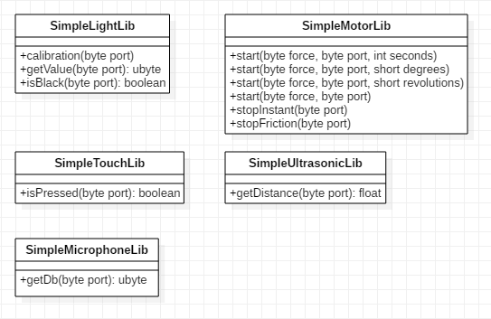
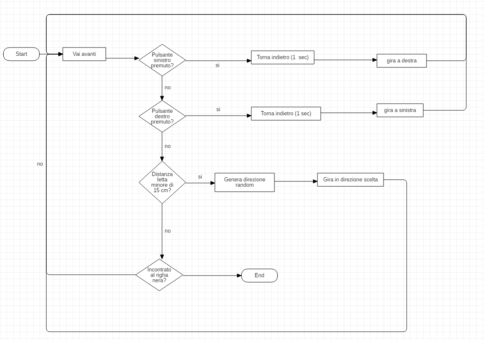

1. [Introduzione](#introduzione)

  - [Informazioni sul progetto](#informazioni-sul-progetto)

  - [Abstract](#abstract)

  - [Scopo](#scopo)

2. [Analisi](#analisi)

  - [Analisi del dominio](#analisi-del-dominio)

  - [Analisi dei mezzi](#analisi-dei-mezzi)

  - [Analisi e specifica dei requisiti](#analisi-e-specifica-dei-requisiti)

  - [Pianificazione](#pianificazione)

3. [Progettazione](#progettazione)

  - [Design dei dati e database](#design-dei-dati-e-database)

4. [Implementazione](#implementazione)

5. [Test](#test)

  - [Protocollo di test](#protocollo-di-test)

  - [Risultati test](#risultati-test)

  - [Mancanze/limitazioni conosciute](#mancanze/limitazioni-conosciute)

6. [Consuntivo](#consuntivo)

7. [Conclusioni](#conclusioni)

  - [Sviluppi futuri](#sviluppi-futuri)

  - [Considerazioni personali](#considerazioni-personali)

8. [Sitografia](#sitografia)

9. [Allegati](#allegati)

<div style="page-break-after: always;"></div>

## Introduzione

### Informazioni sul progetto

  Il progetto sarà gestito e realizzato dall’allievo Luca Di Bello e Fadil Smajlbasic (studenti di informatica all’Arti e Mestieri di Trevano) sotto la supervisione del professor Luca Muggiasca, Adriano Barchi, Francesco Mussi e dalla professoressa Elisa Nannini.
  La realizzazione del progetto prenderà piede il 16 novembre 2018 (16/11/18) e dovrà essere consegnato entro il 25.01.19

### Abstract

  In this document we will describe how we made a library for the Lego Mindstorms NXT. The library needed to be simple to use. Before our solution the users needed to use the IDE provided by Lego, and use the graphical interface whitch makes even a simple line follower a frustrating operation of needing to use the drag and drop function of the “Lego programming blocks”. We were tasked to make the process simpler creating a library with some useful functions for the various input-output interfaces (buttons, ultrasonic sensors, motors, ecc.) that the NXT has to offer, furthermore it uses the standard coding format that a lot of programming languages use since it derives from C. We had the RobotC language to write the library. With the help of this library an average student should be able to do basic programs for the Lego NXT without any problems.

### Scopo
  Lo scopo del progetto è di creare delle librerie da utilizzare per la programmazione del blocchetto NXT. Lo scopo di questa libreria è rendere la programmazione del robot lego più semplice ed efficace aggiungendo delle funzionalità tipiche per ogni sensore del robot. Questo permette di salvare molto tempo nel processo di implementazione del codice.

## Analisi

### Analisi del dominio

  In questo momento il blocchetto NXT viene programmato tramite il programma grafico chiamato “Lego Mindstorms”, esso non necessita alcuna conoscenza di linguaggi di programmazione per essere utilizzato, questo perchè utilizza una programmazione grafica e non testuale.
  Essendo molto semplice la programmazione grafica si perdono diverse funzionalità che si possono riottenere cambiando approccio, e quindi passando alla programmazione nuda e cruda. Essa può essere svolta con il lunguaggio *RobotC*.
  Gli alunni che utilizzano i robot Lego non hanno mai programmato i blocchetti in un linguaggio differente da quello grafico, ma dispongono delle limitate conoscenze del linguaggio Java.

### Analisi e specifica dei requisiti

  Il committente necessita di una libreria scritta nel linguaggio *RobotC* il quale scopo è quello di semplificare il processo di programmazione dei robot NXT della Lego. Esse devono comprendere dei metodi user-friendly (quindi che vengono richiamati e funzionano senza nessun bisogno di una programmazione aggiuntiva da parte dell'utilizzatore). Oltre alle libreria il committente necessita anche di una guida cartacea che spiega il processo di installazione dei firmware per far interagire la nostra libreria con il blocchetto.
  Per poter usufruire delle semplificazioni del codice che offre il nostro prodotto bisogna soltanto importare la libreria nel proprio file. Essa conterrà delle funzioni che svolgono delle funzioni prefabbricate. L'obbiettivo del nostro lavoro è di creare un prodotto plug-and-play, il quale non necessita molte conoscenze di programmazione per essere utilizzato. L'utente quindi dovrà interagire in modo minimo con il codice, l'unica cosa che dovrà fare è creare un algoritmo utilizzando le funzioni già scritte all'interno della nostra libreria, quindi non fa altro che fare un collage di funzioni al fine di raggiungere un algoritmo che svolge una/delle azioni desiderate.

  |ID  |REQ-001                                         |
  |----|------------------------------------------------|
  |**Nome**    |Libreria in RobotC|
  |**Priorità**|1                     |
  |**Versione**|1.0                   |
  |            |**Sotto requisiti**|
  |**001**      | Classe per l'utilizzo semplificato dei motori|
  |**002**      | Classe che implementa tutti i tipi di wait presenti in Lego MindStorms|
  |**003**      | Codice ben commentato (Inglese o Italiano)|

  |ID  |REQ-002                                         |
  |----|------------------------------------------------|
  |**Nome**    |Guide d'utilizzo |
  |**Priorità**|1                     |
  |**Versione**|1.0                   |
  |**Note**    | Da consegnare alla fine del progetto in allegato alla documentazione|
  |            |**Sotto requisiti**|
  |**001**      | Guida all'installazione dei firmware sul blocchetto|
  |**002**      | Guida che istruisce l'utente all'utilizzo del blocchetto|

  |ID  |REQ-003                                         |
  |----|------------------------------------------------|
  |**Nome**    | Verifica funzionamento sensori e attuatori |
  |**Priorità**|1                     |
  |**Versione**|1.0                   |
  |            |**Sotto requisiti**|
  |**001**      | Controllare che tutti i sensori ed attuatori funzionino correttamente|
  |**002**      | Controllare che ci siano 6 cavi per collegare i sensori/attuatori al blocchetto|

  |ID  |REQ-004                                         |
  |----|------------------------------------------------|
  |**Nome**    | Programma di esempio |
  |**Priorità**|2                     |
  |**Versione**|1.0                   |
  |            |**Sotto requisiti**|
  |**001**      | Explorer con 4 sensori (Ultrasuoni, due touch, un sensore di luce)|

### Pianificazione


### Analisi dei mezzi

Per la realizzazione della libreria nel linguaggio RobotC useremo l'IDE di RobotC (v4.56) con la licenza fornita dalla scuola.
Il prodotto verrà utilizzato dagli sviluppatori per programmare i loro algoritmi.
La nostra soluzione verrà svulippata e testata utilizzando un Lego NXT.
Per la comunicazione tra il pc è il blochettto lego abbiamo bisogno di un driver trovabile sul sito ufficiale di Lego, esso è chiamato *NXT Fantom Drivers v120*.

Lista delle specifiche tecniche dei computer sui quali è stato realizzato l'intero progetto:
<ol>
  <li>
    Specifiche computer di Luca:
    <ul>
      <li>Nome: Portatile Asus gl702vm</li>
      <li>CPU: I7-7700HQ</li>
      <li>GPU: Nvidia GTX 1060 6GB</li>
      <li>RAM: 16GB</li>
      <li>OS: Windows 10 Home 64 bit</li>
    </ul>
  </li>
  <li>
  Specifiche computer di Fadil:
  <ul>
    <li>Nome: Portatile HP Pavilion cs0800nz</li>
    <li>CPU: I7-8550U</li>
    <li>GPU: Intel UHD Graphics 620</li>
    <li>RAM: 16GB</li>
    <li>OS: Windows 10 Home 64 bit</li>
  </ul>
  </li>
</ol>

## Progettazione

### Design dei dati e database

Nell'immagine sottostante è raffigurato il diagramma UML raffigurante la struttura delle varie classi che abbiamo utilizzato per lo sviluppo della libreria:



## Implementazione

<!-- In questo capitolo dovrà essere mostrato come è stato realizzato il
lavoro. Questa parte può differenziarsi dalla progettazione in quanto il
risultato ottenuto non per forza può essere come era stato progettato.

Sulla base di queste informazioni il lavoro svolto dovrà essere
riproducibile.

In questa parte è richiesto l’inserimento di codice sorgente/print
screen di maschere solamente per quei passaggi particolarmente
significativi e/o critici.

Inoltre dovranno essere descritte eventuali varianti di soluzione o
scelte di prodotti con motivazione delle scelte.

Non deve apparire nessuna forma di guida d’uso di librerie o di
componenti utilizzati. Eventualmente questa va allegata.

Per eventuali dettagli si possono inserire riferimenti ai diari. -->

Come è già stato detto in precedenza il nostro compito è stato quello di creare delle librerie che semplificano la programmazione dei robot NXT. Noi abbiamo sviluppato due librerie:
La prima è chiamata "SimpleWaitLib", la quale contiene tutti i tipi di wait presenti. La seconda libreria invece si chiama "SimpleMotorLib", la quale implementa delle funzionalità semplificate
per l'utilizzo dei motori.
Avevamo pensato di implementare una libreria per sensore, ma abbiamo notato che RobotC metteva già a disposizione del programmatore delle funzioni semplificate. L'unico attuatore che non presentava funzionalità
prefabbricate era proprio il motore, questo ci ha portato a sviluppare noi le funzioni mancanti.

### SimpleWaitLib

Per sviluppare la libreria contenete le varie funzioni di waiting (Libreria SimpleWaitLib) non abbiamo fatto altro che aprire il programma originale per la programmazione dei blocchetti (Lego MindStorms) e sviluppato tutti i tipi di wait presenti. Essi sono questi:

- wait
- waitNxtButtons
- waitDistance
- waitMicrophone
- waitLight
- waitTouch

#### Wait

Questo metodo è utilizzato per far aspettare/continuare un operazione per un tot di secondi.
Il numero di secondi verrà passato al metodo tramite parametro: ```wait(float secondi)```.
Questo metodo non fa altro che richiamare la funzione di sleep già implementata in RobotC. Abbiamo deciso di implementare questo metodo per avere un nome più autoesplicativo

#### WaitNxtButtons

Questo metodo è utilizzato per far aspettare/continuare un operazione finchè uno dei pulsanti del blocchetto (quelli posti sotto il display) venga premuto. Il pulsate da premere viene specificato come parametro al richiamo della funzione: ```waitNxtButtons(short id_pulsante)```.

Gli id dei pulsanti sono questi:
0: Rettangolo grigio
1: Freccia destra
2: Freccia sinistra
3: Quadrato arancione

#### WaitDistance

Questo metodo è utilizzato per far aspettare/continure un operazione finchè il sensore ultrasuoni (di distanza) non rileva una certa distanza. La funzione può essere "tarata" in modo da poter scegliere se la distanza dev'essere minore o maggiore di un certo valore. Ovviamente per utilizzare questa funzionalità bisogna avere a disposizione un sensore ad ultrasuoni.
Queste impostazioni si passano al metodo come parametro: ```waitDistance(short sensore,int distanza, short modalità)```

Come ho detto il precedenza la funzione permette la possibilità di essere tarata, questo si può fare tramite il parametro modalità. Se passo il valore 0 non fa altro che aspettare finchè il valore corrente (letto dal sensore) sia minore di quello passato (parametro "distanza"). Se si passa il valore 1 come modalità la funzione fa l'esatto contrario: aspetta finchè il valore corrente sia maggiore di quello passato.
Il parametro "distanza" può avere un valore massimo di 255 cm.

N.B. Il parametro "sensore" non è altro che la referenza al sensore.

#### WaitMicrophone

Questo metodo è utilizzato per far aspettare/continure un operazione finchè il microfono non rileva una certo valore di Db (Decibel). Anche questa funzione può essere tarata in modo da poter scegliere se il valore di Db dev'essere minore o maggiore di un certo valore. Ovviamente per utilizzare questa funzionalità bisogna avere a disposizione microfono.
Queste impostazioni si passano al metodo come parametro: ```waitMicrophone(short sensore,int decibel, short modalità)```

Il parametro "sensore" non è altro che una referenza al sensore (microfono in questo caso). Il parametro "modalità" invece serve per poter tarare la funzione.
Se al parametro modalità viene passato il valore 0, la funzione aspetta finchè i Db letti dal microfono siano minori del valore passato nel parametro "decibel". Se si passa 1 la funzione aspetta finchè il valore letto dal microfono sia maggiore di quello passato come target.

#### WaitLight

Questo metodo è utilizzato per far aspettare/continure un operazione finchè il sensore di luce non rileva una certa percentuale di luce riflessa. Anche questa funzione può essere tarata in modo da poter scegliere se il valore di  dev'essere minore o maggiore di un certo valore. Ovviamente per utilizzare questa funzionalità bisogna avere a disposizione un sensore di luce.
Queste impostazioni si passano al metodo come parametro: ```waitLight(short sensore,int percentuale_luce, short modalità)```

Il parametro "sensore" non è altro che una referenza al sensore (sensore di luce in questo caso). Il parametro "modalità" invece serve per poter tarare la funzione.
Se al parametro modalità viene passato il valore 0, la funzione aspetta finchè il valore letto dal sensore di luce sia minore del valore passato nel parametro "percentuale_luce". Se si passa 1 la funzione aspetta finchè il valore letto sensore di luce sia maggiore di quello passato come target.

#### WaitTouch

Questo metodo è utilizzato per far aspettare/continure un operazione finchè non avviene una determinata operazione sul sensore touch (pulsante). Questa "determinata azione" si può impostare al richiamo del metodo tramite il parametro mode: ```waitTouch(short port,short mode)```

Il parametro "mode" ha 3 diffenti opzioni. Se viene passato il valore 0 il metodo bloccherà il programma finchè il pulsante verrà premuto (pressed). Se gli viene passato 1 invece il programma aspetterà finchè il pulsante sarà rilasciato (released) ed infine se viene impostato a 2 il programma aspetterà finchè il pulsante viene premuto e rilasciato.

### SimpleMotorLib

Per sviluppare la libreria contenete le varie funzioni relative ai motori abbiamo utilizzato lo stesso metodo attuato per lo sviluppo di *SimpleWaitLib*: abbiamo usato il programma Lego MindStorms per vedere quali funzioni hanno disponibili i motori per poi svilupparne una ad una con il linguaggio RobotC.
Queste sono tutte le funzioni disponibili per i motori:

- goMotorStandard
- goMotorSeconds
- goMotorDegrees
- goMotorRotations
- stopMotor

#### goMotorStandard

#### goMotorSeconds

#### goMotorDegrees

#### goMotorRotations

#### stopMotor

### Explorer

Per mostrare l'utilizzo delle noste librerie sviluppate abbiamo creato un programma d'esempio. Il programma ha come scopo quello di far esplorare il territorio al robot.

##### Il diagramma di flusso del programma



## Test

### Protocollo di test

|Test Case      | TC-001                            |
|---------------|--------------------------------------|
|**Nome**       |Test sensori e attuatori |
|**Riferimento**|REQ-003                               |
|**Descrizione**|Controllare i valori letti dai sensori ed attuatori per garantirne il corretto funzionamento |
|**Procedura**     | - Accendere il blocchetto NXT <br> - Navigare tramite i relativi tasti nel menu principale e selezionare l'opzione *View* <br> - Controllare il corretto funzionamento di ogni sensore ed attuatore |
|**Risultati attesi** | Valori validi e sensati da tutti i sensori ed attuatori. La velocità ed i tick dei motori devono essere realistici.  |


|Test Case      | TC-002                            |
|---------------|--------------------------------------|
|**Nome**       |Test delle due classi che compongono la libreria |
|**Riferimento**|REQ-001 <br> REQ-004 |
|**Descrizione**|Con questo test controlliamo il giusto funzionamento dei metodi delle due classi che compongono la libreria |
|**Procedura**     | Per svolgere i test dei vari metodi delle classi abbiamo creato il Programma di test Explorer (riferimento: [Explorer](#explorer))  |
|**Risultati attesi** | Si aspettano prestazioni ottimali del robot utilizzando le libreria scritta in robotC e un corretto funzionamento dei metodi |


<!-- #### template test case:
|Test Case       | TC-003                             |
|----------------|--------------------------------------|
|**Nome**        |`*NAME*` |
|**Riferimento** | REQ-001                          |
|**Descrizione** |Verificare la giusta funzionalità del metodo methodName della libreria SimpleWaitLib |
|**Prerequisiti**| Finire di scrivere la libreria<br>Collegare un motore alla porta A <br> Collegare il sensore nella porta  |
|**Procedura**   | - Creare un file di test <br> - Inserire il riferimento alla libreria con `#include "SimpleWaitLib.h"` <br> - eseguire il seguente pezzo di codice: `*CODE*` |
|**Risultati attesi** |  | -->


### Risultati test

| Nome    | ID    | Risultato |
|-----    |----   |-----------|
|Test sensori e attuatori    |TC-001 |passato    |
|Test delle due classi che compongono la libreria  |TC-002 |passato    |

### Mancanze/limitazioni conosciute

Descrizione con motivazione di eventuali elementi mancanti o non
completamente implementati, al di fuori dei test case. Non devono essere
riportati gli errori e i problemi riscontrati e poi risolti durante il
progetto.

## Consuntivo

Consuntivo del tempo di lavoro effettivo e considerazioni riguardo le
differenze rispetto alla pianificazione (cap 1.7) (ad esempio Gannt
consuntivo).

## Conclusioni


La nostra soluzione aiuterà in un modo significante alle generazini future di sviluppare programmi più complessi da utilizzare nella First Lego League o nella WRO.

<!-- Quali sono le implicazioni della mia soluzione? Che impatto avrà?
Cambierà il mondo? È un successo importante? È solo un’aggiunta
marginale o è semplicemente servita per scoprire che questo percorso è
stato una perdita di tempo? I risultati ottenuti sono generali,
facilmente generalizzabili o sono specifici di un caso particolare? ecc -->

### Sviluppi futuri
  Nel futuro si potrebbero aggiungere delle funzionalità per semplificare ancora di più la programmazione del lego NXT robot. Una di queste funzionalità potrebbe essere il preciso sterzo del robot in base alla sua larghezza e al diametro della ruota.
  <!-- Migliorie o estensioni che possono essere sviluppate sul prodotto. -->

### Considerazioni personali

  Cosa ho imparato in questo progetto? ecc

### Sitografia

- http://www.robotc.net/wikiarchive/General, *General Programming - RobotC*, consultato più volte durante tutto l’arco dell’implementazione progetto

- http://www.robotc.net/forums/, *RobotC.net forums*, consultato più volte durante tutto l’arco dell’implementazione progetto

- http://www.legoengineering.com/clicking-brick-syndrome/ Per risolvere i problemi durante l'installazione del firmware


## Allegati
<h1 style="color: red;">DA COMPLETARE </h1>

- Diari di lavoro
- Codici sorgente/documentazione macchine virtuali
- Eventuali guide utente / Manuali di utilizzo
- Mandato e/o Qdc
- Prodotto
