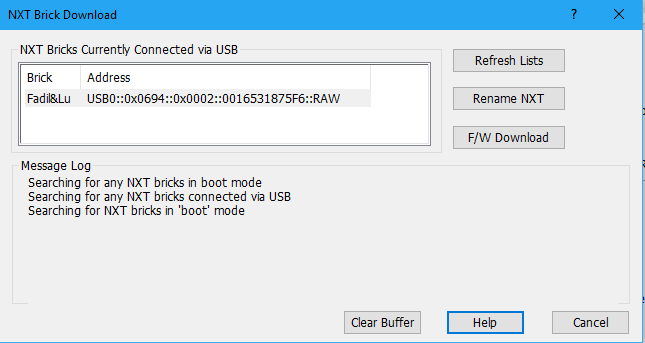

# Installazione del firmware di RobotC

## Informazioni
Per eseguire i programmi scritti nel linguaggio *RobotC* è necessaria l'installazione di un firmware apposito. Esso è disponibile scaricando l'IDE di RobotC dal sito ufficiale (http://www.robotc.net).

## Preparazione
Se non si ha ancora l'IDE ufficiale installato bisogna scaricarlo recandosi nella pagina di download nel sito di RobotC (link scritto in precedenza). L'IDE offre un free trial (prova gratuita) della durata di 10 giorni. __Una volta terminato il periodo di prova l'IDE risulta inutilizzabile e si è obbligati a pagare la licenza__.

## Procedura
Come prima cosa bisogna aprire l'IDE di RobotC, una volta aperto ci si troverà in una finestra simile a questa:

Adesso possiamo collegare il nostro blocchetto al computer. Una volta collegato si può continuare nel processo di installazione, questo seguendo questa procedura di azioni (pulsanti posti nel menù superiore): **Robot > Download Firmware > Standard File**.
Questo aprirà una finestra la quale mostrerà tutti i blocchetti collegati al computer:

Per installare il firmware basta soltanto selezionare il robot interessato e poi cliccando il pulsante sulla destra intitolato "*F/W Download*". Questo installerà automaticamente il nuovo firmware all'interno del blocchetto (il firmware che aveva in precedenza il blocchetto verrà naturalmente sovrascritto).

## Bootloop / Altri errori

Il blocchetto non parte più o entra in bootloop? Probabilmente c'è stato un qualche problema durante il cambio di firmware.
Queste sono delle cause possibili di questo problema:

* Firmware Update non terminato
* Premuto tasto di hard reset
* Cambiato firmware / installato un firmware differente (es: cambiare firmware tra NXT, RobotC, Enchanting, LabVIEW ecc.)
* Programma veramente mal programmato (raro, ma non impossibile)
* Scollegato il blocchetto quando si stava caricando un programma

Per la soluzione a questo problema o per ulteriori informazioni è consigliabile recarsi nella pagina http://www.legoengineering.com/clicking-brick-syndrome/
